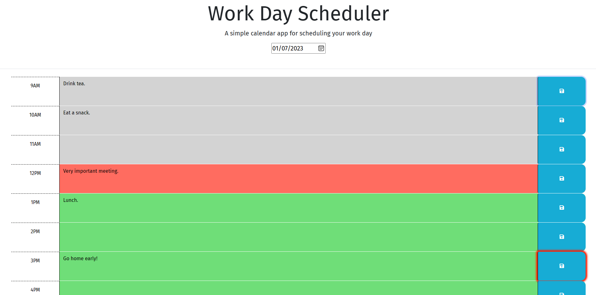

# day-planner

## Description

This website helps the user store tasks during business hours and refer to them later. All task data is stored locally and can be easily modified and saved hour by hour. Color-coding helps the user quickly identify whether the time for a task has passed, is now, or is coming up soon. Tasks can be written indefinitely far into the future and will be there to remind the user if the page is loaded on the day in which they were entered.

## Installation

N/A

## Usage

The page will always initially load to the current day's data. Color-coding will help you identify where in the day's agenda you are right now: gray blocks were in the past, green in the future, and red is the current hour. 

Simply select the text area in the middle for whichever hour you wish to modify, and type your tasks accordingly. When you are done, the save icon to the right will save the data for that hour. 

If you modify the text in a block and don't save it, the save icon will be highlighted red to remind you. 

At the bottom of the page, a button reads "Clear This Day's Stored Data." If clicked, this button will entirely remove the data for the currently selected day from your local storage and reset the page. 

To view the deployed product, visit: https://hornickjohn.github.io/day-planner/

## Credits

N/A

## License

N/A

## As-Deployed Screenshot

